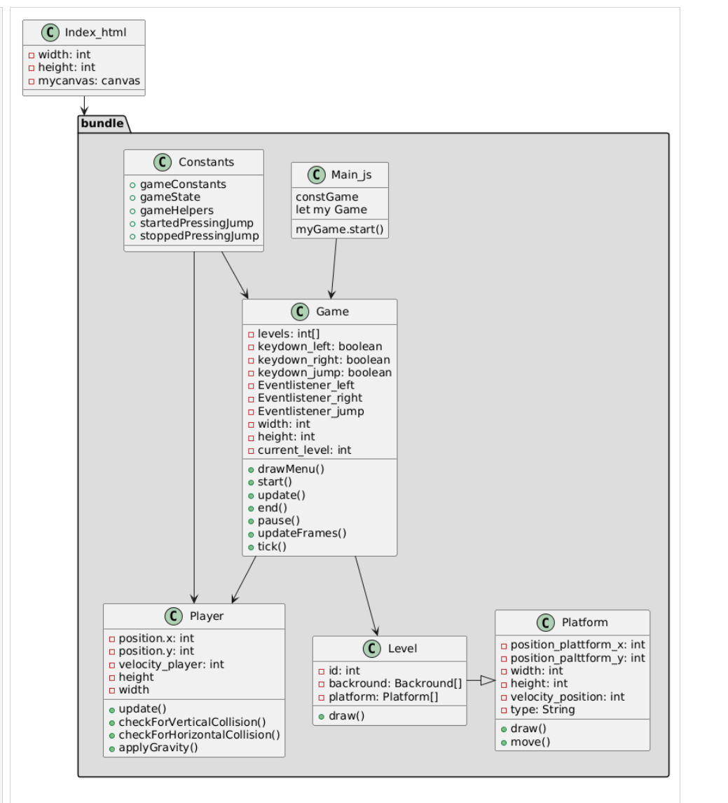

# browsergame-baseapp

The browsergame-baseapp is a tiny client-side application that may serve as a starting point to develop your own browsergame. 
It has an educational focus and provides some basic, object-oriented infrastructure. 

How to start
------------
To start the demo, simply open the file public/index.html in a webbrowser of your choice.

The example uses the tool browserify/watchify to pack all clientside-code into one file named bundle.js.
If you change code, use watchify to update bundle.js.
First, install watchify by

    >npm install -g watchify

Then start it from the project directory by

    >watchify ./client/main.js -o ./public/bundle.js

Watchify observes all your javascript files. 
Whenever a file changes, it automatically builds a new bundle.js.
The latter command is included in package.json and hence can be started from tools like visual studio code.

Hier ist der aktualisierte und formatierte Projektplan:

---

**Projektplan: Browsergame - Bachelorarbeit**

---

### Aktueller Fortschritt
- **Projekteinrichtung**: Git und Entwicklungsumgebung – **Abgeschlossen**
- **Gravitation** – **Abgeschlossen**
- **Spielerbewegung** – **Fast Abgeschlossen**
- **Hintergrund (Karte)**: Soll gemalt und mit Hilfe von Tiles erstellt werden – **In Arbeit**
- **Kollisionsabfrage**:
  - Vertikale und horizontale Kollision
  - Block-Kollision
- **Spieleranimation** (falls benötigt)
- **Hitbox-Implementierung**: Grobe Kopf-Kollision für den Spieler; unser PNG ist etwas größer als das tatsächliche Spielermodell
- **Spieleranimationen**: Fortgeschrittene Animationen, z.B. Laufen, Springen usw.
- **Plattform-Kollision** – **In Arbeit**
- **Horizontale Kamerabewegung**
- **Vertikale Kamerabewegung**
- **Levelwechsel**
- **Fortschritt speichern**
- **Checkpoints einbauen**

---

### Aufgaben für die Woche (11. Nov. - 17. Nov.)
**Ziel:** Abschluss bis zum nächsten Jour Fixe

1. **Entwurf der Karte mit Tiles**  
   - **Zuständig:** Omar  
   - Erstellen eines Entwurfs für die Karte im Tile-Format.

2. **Spielerentwurf (PNG)**  
   - **Zuständig:** [Name hier eintragen]  
   - Gestaltung eines grundlegenden PNG-Bilds für den Spieler.

3. **Hauptmenü**  
   - **Zuständig:** Paul  
   - Entwurf des Hauptmenüs für das Spiel.

4. **Entwurf der Plattform-Kollision**  
   - **Zuständig:** Inke  
   - Vorläufiges Design für die Plattform-Kollisionsabfrage erstellen.

---

Gib Bescheid, falls du weitere Anpassungen benötigst!
